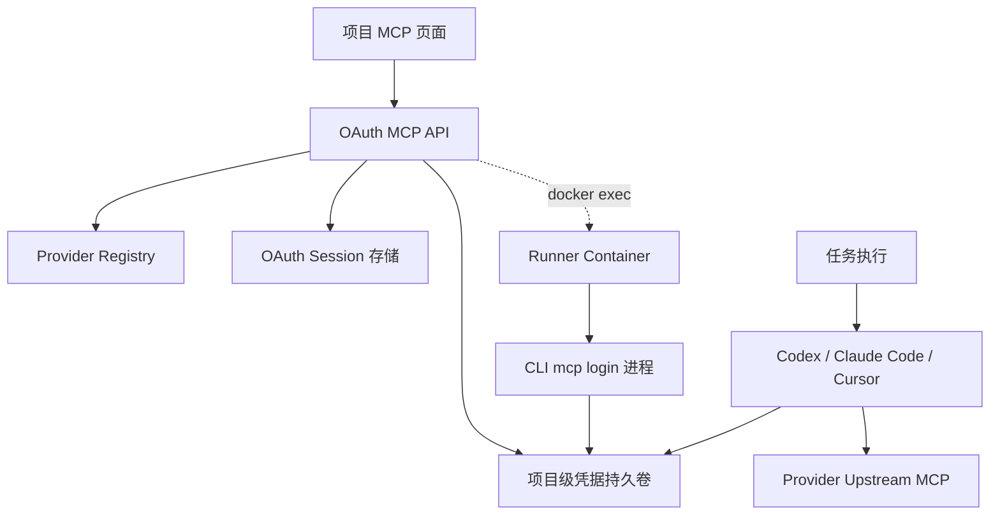

# OAuth MCP Native Login Relay 框架设计

## 背景

在 Runner 容器内执行 `codex mcp login <provider>` 这类命令时，OAuth callback 监听容器内 `http://127.0.0.1:<port>/callback`。用户在宿主机浏览器完成授权后，浏览器里的 `127.0.0.1` 指向的是宿主机而不是容器，callback 无法回到 Agent CLI 进程，整个登录卡住。

这个痛点不是 Figma 或 Codex 独有的，后续接入任意 OAuth MCP 时都会遇到。需要建设平台级能力：用户在 AINative Web 页面完成项目级登录，其它一切（容器、CLI、callback 转发、凭据持久化）由平台兜住。

### Figma 限制（已验证）

实施前已经做过两轮验证，结论列在前面以约束方案选型：

- Figma 的 `mcp:connect` OAuth scope **不对一般第三方 OAuth app 开放**，参见 [Figma Forum - mcp:connect scope](https://forum.figma.com/ask-the-community-7/how-to-access-mcp-oauth-scope-mcp-connect-50630)、[Figma Developer Docs - Plans, access, and permissions](https://developers.figma.com/docs/figma-mcp-server/plans-access-and-permissions)。AINative 作为第三方平台不能注册自己的 Figma OAuth client，只能复用 Codex / Claude Code / Cursor 这些 Catalog 客户端的 client_id。
- 在 Codex 里实测把 `mcp_oauth_callback_url` 设为 AINative 公网 URL，Figma OAuth server 直接返回 `Invalid redirect uri`。Codex 客户端在 Figma 注册的 `redirect_uri` 只允许 loopback (`http://127.0.0.1:*`)，AINative 没有渠道修改这个白名单。

### 方案选型决策

基于 Figma 的限制以及对未来其它 OAuth MCP provider 的预期，本框架的最终决策是：**所有 OAuth MCP provider 统一走 native callback relay**。

具体含义：

- 平台**不**作为任何 provider 的 OAuth client。
- Agent CLI（Codex / Claude Code / Cursor）继续作为它们已经获 provider 接受的 OAuth client，在 runner 容器内运行原生 `mcp login` 命令。
- 平台只负责把浏览器侧的 callback URL 中转进容器，并把 CLI 写入的凭据持久化到项目级容器卷里。
- 平台不持有 access token / refresh token，凭据安全责任由 CLI 自身管理。

被显式排除的方案：

- 平台作为 OAuth client + auth proxy 的 `platform-oauth` 模式：因为 Figma 当前不开放第三方 client，且即使 GitHub / Sentry / Linear 可以走，平台持有用户凭据带来的合规风险与 token refresh / SSE 透传等工程复杂度收益不成比例。框架不为该模式预留实现路径。

## 目标

- 用户在项目 MCP 页面完成一次授权后，同项目内任意 Agent CLI 任务都能直接使用对应 OAuth MCP，不再进入容器或手工搬运 callback。
- Figma 是首个高优先级 provider，必须立刻可用。
- 框架以 provider registry 形式承载 Figma 与未来 provider，新增一个 OAuth MCP provider 只需要在 registry 添加配置 + 复用相同的登录中转流程。
- OAuth、凭据持久化、断开授权、状态查询统一由平台提供。
- access token / refresh token 不进入 AINative 数据库、日志或 API 响应。

## 非目标

- 本阶段不把 OAuth MCP 工具暴露给任务详情页的产品聊天层，只覆盖 Runner 内的 Agent CLI 子进程。
- 不为每个 provider 单独实现一套 controller、数据表、CLI 注入逻辑。
- 不默认覆盖用户项目仓库内已有的同名 MCP 配置；冲突策略以最小破坏为准。
- 不强制要求用户在本机安装 AINative CLI 工具或浏览器扩展。
- 不实现平台侧的 OAuth client 管理、token 加密存储、token refresh 与 auth proxy 能力。
- 不针对使用静态 PAT / API key 的 MCP（例如部分 GitHub MCP 实现）做覆盖；那属于另一条独立的 MCP 凭据接入路径，不在本框架范围内。

## 用户体验流程

```text
1. 项目 MCP 页面看到对应 provider 卡片，状态「未授权」
2. 点击「授权 <Provider>」按钮
3. AINative 后端在项目 runner 容器内启动 CLI 原生 mcp login
   - 抓取 OAuth URL 并通过 SSE 推送到当前页面
4. 页面显示：
   - 「打开 <Provider> 授权页面」按钮（指向 OAuth URL）
   - 预先提示：「授权完成后浏览器会显示『无法访问 127.0.0.1』，这是预期行为，请回到本页面」
   - 「读取剪贴板并完成登录」按钮
   - 兜底：「手动粘贴回调 URL」文本框
5. 用户点击「打开 <Provider> 授权页面」
6. 用户在 provider 完成授权
7. 浏览器跳转 http://127.0.0.1:<port>/callback?code=...&state=...
   - 浏览器显示连接失败页面，但地址栏保留完整 URL
8. 用户回到 AINative 标签页，点击「读取剪贴板并完成登录」
   - 浏览器允许通过用户点击触发 navigator.clipboard.readText()
9. AINative 后端收到 callback URL：
   - 校验 sessionId 与 state
   - 通过 docker exec 在容器内向 127.0.0.1:<port> 发出该请求
   - CLI 进程接收到 callback，完成 OAuth，凭据写入项目级持久卷
10. 后端 SSE 推送「<Provider> 已授权」
11. 同项目后续任何 Agent CLI 任务直接复用容器内 provider 凭据
```

## 总体架构



## Provider Registry

后端新增 `backend/src/mcps/oauth-providers`，按 provider 注册声明式配置。

```ts
type OAuthMcpProviderDefinition = {
  provider: string
  displayName: string
  upstreamMcpUrl: string

  cliLogin: {
    codex?: { command: string[]; callbackPort: number }
    claude?: { command: string[]; callbackPort: number }
    cursor?: { command: string[]; callbackPort: number }
  }
  cliLogout?: {
    codex?: string[]
    claude?: string[]
    cursor?: string[]
  }

  enabledByDefault?: boolean
  statusHints?: { disconnected?: string; expired?: string }
}
```

Figma 首发示例：

```ts
{
  provider: 'figma',
  displayName: 'Figma',
  upstreamMcpUrl: 'https://mcp.figma.com/mcp',
  cliLogin: {
    codex: { command: ['codex', 'mcp', 'login', 'figma'], callbackPort: 38555 },
    claude: { command: ['claude', 'mcp', 'add', '--transport', 'http', 'figma', 'https://mcp.figma.com/mcp'], callbackPort: 38556 },
    cursor: { command: ['agent', 'mcp', 'login', 'figma'], callbackPort: 38557 },
  },
  cliLogout: {
    codex: ['codex', 'mcp', 'logout', 'figma'],
    claude: ['claude', 'mcp', 'remove', 'figma'],
    cursor: ['agent', 'mcp', 'logout', 'figma'],
  },
}
```

后续每接一个 OAuth MCP provider，只新增一项 registry 配置即可。

## 后端 API

通用 API（路径 provider 化，便于按 provider 拆权限与限流）：

- `GET /v1/mcps/project-oauth/providers`
  - 返回 provider 列表 + 展示元信息（displayName、当前 CLI 支持矩阵）。
- `GET /v1/mcps/project-oauth/:provider/status?projectId=...`
  - 按容器凭据卷探测，返回 `connected | disconnected | pending | error` 及各 CLI 已登录状态。不返回任何凭据内容。
- `POST /v1/mcps/project-oauth/:provider/start`
  - 选择目标 CLI（默认按业务线 default agent CLI 推断），在 runner 容器内启动 CLI 原生 mcp login 命令。
  - 返回 `{ sessionId, oauthUrl, expiresAt }`，OAuth URL 之后通过 SSE 实时推。
- `POST /v1/mcps/project-oauth/:provider/relay-callback`
  - body：用户从浏览器地址栏复制的 callback URL。
  - 后端解析 `code`、`state`，校验 sessionId 匹配，通过 `docker exec` 在容器内 `curl` 该 URL；CLI 进程感知 callback 后完成 OAuth。
- `DELETE /v1/mcps/project-oauth/:provider?projectId=...&cli=...`
  - 在 runner 容器内运行 `cliLogout`；可指定单一 CLI 或全部。
  - 同步清理凭据卷里的 provider 相关文件。

权限：

- 状态读取：`project.mcp.read`。
- 启动 / relay / 断开：`ProjectAccessService.assertCanManageProject`。

## 数据模型

平台不存储 token，只存「项目 × provider」link 与短生命周期 session。

`ProjectMcpOAuthConnection`：

- `projectId`
- `provider`
- `cliRegistry`：`{ codex?: { lastLoginAt, status }, claude?: { ... }, cursor?: { ... } }`
- `credentialVolumeRef`：项目级命名卷的引用
- `authorizedByUserId`：发起最近一次授权的用户
- `lastError`
- `createdAt` / `updatedAt`

`ProjectMcpOAuthSession`（短生命周期，用于 start → relay 之间的状态跟踪）：

- `sessionId`
- `projectId`
- `provider`
- `cli`：本次登录针对的 CLI（codex / claude / cursor）
- `state`：CLI 输出的 OAuth state（用于 relay 时强校验）
- `containerExecRef`：CLI login 进程所在容器引用
- `cliLoginPort`：CLI 监听端口
- `expiresAt`：默认 5 分钟超时
- `status`：`pending | relayed | succeeded | failed | timed_out`

存储要求：

- 任何字段均不包含 token。
- `state` 只在 session 表内存活，session 完成或超时即清理。
- API 层禁止把 sessionId 之外的 session 字段返回给前端。

## Native Callback Relay 实现

在 `backend/src/agent-execution` 下新增 `RunnerOAuthLoginService`，与 [`runner-ephemeral-mcp.service.ts`](../../backend/src/agent-execution/runner-ephemeral-mcp.service.ts) 共用 `docker exec` 通道。

启动 OAuth 登录：

1. 选定 runner 容器（项目持久 runner）。
2. 在容器内 `docker exec` 运行 `cliLogin.command`，监听端口由 registry 指定。
3. 抓取 stdout 找到 OAuth URL（按 CLI 输出格式适配）。
4. 把 URL 通过 SSE 推到 Web 页面，记录 sessionId / containerExecRef / port / state。

接收 callback：

1. 用户从浏览器地址栏拿到 `http://127.0.0.1:<port>/callback?code=...&state=...`。
2. 提交到 `POST /relay-callback`。
3. 后端校验 sessionId 与 state；`docker exec` 在该容器内执行：

```bash
curl -fsS "http://127.0.0.1:<port>/callback?code=...&state=..."
```

4. CLI 进程感知到 callback，完成 OAuth，把凭据写入约定路径。

session 生命周期：

- 启动后默认 5 分钟超时；超时清理 CLI 进程，session 失效。
- 一个项目同一时刻只允许一个进行中的 OAuth session，避免端口冲突与 state 复用。
- session 失败时记录原因并提示用户重新发起。

## CLI 凭据持久化

凭据由 CLI 自己写入容器，平台只保证存储介质跨任务可复用。

- runner 容器启动时挂载项目级命名卷：

```text
ainative-mcp-creds-<projectId>:/home/runner/.ainative-mcp-creds
```

- 通过环境变量重定向 CLI 凭据存储路径（具体环境变量名以 spike 验证为准）：

```text
CODEX_HOME=/home/runner/.ainative-mcp-creds/codex
CLAUDE_*=/home/runner/.ainative-mcp-creds/claude
CURSOR_*=/home/runner/.ainative-mcp-creds/cursor
```

- 卷生命周期与项目对齐；项目删除时同步清理。
- 卷只挂载到 OAuth login 与 Agent CLI 任务的 `docker exec` 上下文，不进入业务工作区 `/workspace`，避免泄漏到仓库。
- 卷不进入备份链路；如果未来需要跨 region 灾备，需单独评估。

## Agent CLI 适配

平台**不**为 OAuth MCP provider 注入额外 MCP 配置：

- CLI 自己已经登录，配置由 CLI 自身管理（例如 Codex 写入 `~/.codex/config.toml`、Cursor 写入 `~/.config/cursor`、Claude Code 写入 `~/.claude`，具体路径以挂载卷重定向后的位置为准）。
- 任务执行链路只确保：
  - 凭据卷在 Agent CLI `docker exec` 时已挂载。
  - 环境变量正确指向卷内路径。
  - 不在 platform 侧重复注入 `mcp_servers.<provider>`，避免覆盖 CLI 自己管的配置。
- 用户项目仓库内已有同名 MCP 配置时，默认不动，与 CLI 现有合并行为一致。

## 前端入口

主入口：[`frontend/src/pages/mcp/index.vue`](../../frontend/src/pages/mcp/index.vue)。

新增「OAuth MCP 集成」区域，按 provider 渲染卡片：

- 「授权 <Provider>」按钮触发 start，页面进入「等待回调」状态，显示 OAuth URL + 操作引导。
- 显著按钮「读取剪贴板并完成登录」，调用 `navigator.clipboard.readText()` 并 POST 给 `relay-callback`。
- 兜底文本框，覆盖浏览器禁止剪贴板访问的场景。
- 显示授权用户、上次登录时间、各 CLI 已登录状态（codex / claude / cursor）。
- 「断开」按钮支持按 CLI 粒度断开或一次断开全部。

前端分层：

- [`frontend/src/types/api/mcps.ts`](../../frontend/src/types/api/mcps.ts) 增加 provider、状态、session、relay 类型。
- [`frontend/src/api/mcps.ts`](../../frontend/src/api/mcps.ts) 增加 `listProjectOAuthProviders`、`getProjectOAuthStatus`、`startProjectOAuth`、`relayProjectOAuthCallback`、`disconnectProjectOAuth`。
- 抽 OAuth 集成卡片到 `frontend/src/features/mcps`，经公开入口暴露给页面，符合五分区依赖方向。
- [`use-mcp-page.ts`](../../frontend/src/pages/mcp/use-mcp-page.ts) 处理 SSE、剪贴板交互、状态刷新。

文案不写死 Figma，统一使用 provider 返回的 `displayName`。

## Spike 项与待验证

实施前先证伪以下假设，避免后期返工：

1. ~~Codex `mcp_oauth_callback_url` 指向 AINative 公网 URL 是否被 Figma 接受~~。已验证：返回 `Invalid redirect uri`，不可行；这是选择 native callback relay 的依据之一。
2. CLI 凭据存储路径是否能通过环境变量重定向：Codex 的 `CODEX_HOME`、Claude Code 的对应变量、Cursor 的对应变量，逐个核对其当前版本的实际行为。
3. CLI 登录命令在容器后台运行时 stdin/stdout 的可靠性：`codex mcp login` 等命令需要稳定地从 stdout 抓 OAuth URL；必要时改用 file-based 输出或 hook。
4. CLI 登录命令是否暴露 callback 端口配置：Codex 有 `mcp_oauth_callback_port`，Claude Code、Cursor 是否有等价能力；如果没有，需要其它方式控制 CLI 监听端口（端口预占 + retry，或读取 CLI 启动日志解析端口）。
5. 同项目并发任务对凭据卷的访问是否需要文件锁；不同 CLI 对凭据文件并发写入的容忍度。
6. runner 镜像现有 Node 环境是否已足够支持登录命令抓 stdout 与 docker exec 协作；不增加镜像依赖。
7. 浏览器对 `navigator.clipboard.readText()` 的权限要求：用户首次点击触发是否需要二次确认；HTTPS 必备。

## 测试计划

- 后端单测：provider registry 解析、OAuth session 状态机、relay-callback URL 校验与 state 匹配、`docker exec` 转发参数构造、断开授权清理逻辑。
- Runner 集成测试：CLI mcp login 启动 → OAuth URL 抓取 → relay-callback 转发 → 凭据写入卷 → 状态切换为 connected。
- Agent runtime：确保 Agent CLI 任务能读到凭据卷中的 provider 凭据，配置不会被平台覆盖。
- 前端：provider 列表、卡片状态、剪贴板读取流程、URL 校验、SSE 状态推送、断开授权交互。
- 端到端：用真实 Figma OAuth 完整跑一次（手工或半自动）。

## 验收标准

- 项目 MCP 页面显示「OAuth MCP 集成」区域，Figma 卡片可见。
- 点击「授权 Figma」后能在 Web 上完成整个流程（授权 → 复制回调 URL → 状态变成已授权）。
- 同项目下分别启动 Codex、Claude Code、Cursor 任务，三者均能通过 `figma` MCP server 访问 Figma 工具。
- 任意任务日志中不出现 access token 或 refresh token 明文。
- AINative 数据库与 API 响应中均不包含 token 字段。
- 「断开授权」后新任务无法访问 Figma MCP；按 CLI 粒度断开时只影响指定 CLI。
- 项目删除时项目级凭据卷被清理。
- provider registry 至少经一个非 Figma provider 配置项验证可扩展（无需实现，只校验配置形式）。
