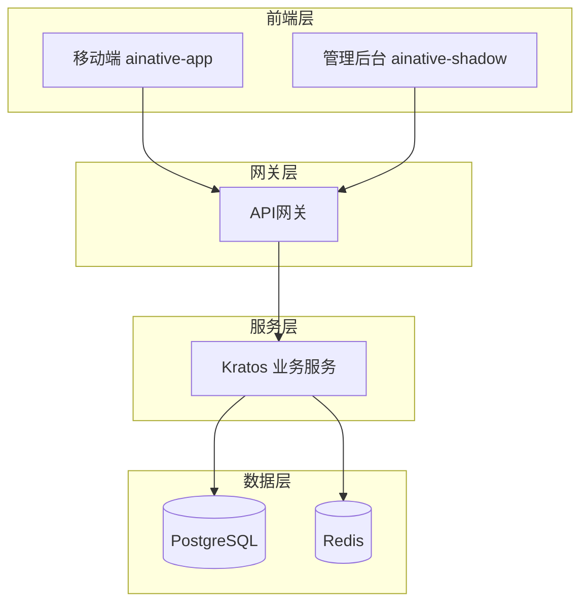
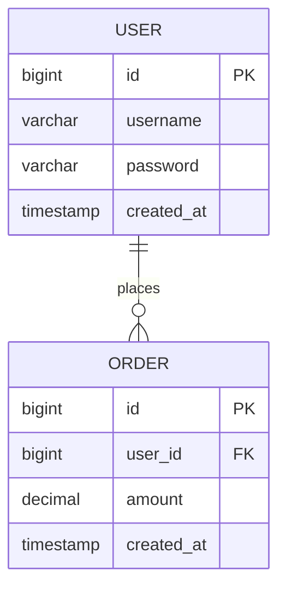

# 系统设计文档

> **重要**：本文档共 8 个章节，禁止添加额外章节。技术选型必须与 `docs/dev-spec/` 开发规范保持一致。

---

## 1. 系统概述

### 1.1 背景与目标

- 系统要解决的核心业务问题
- 使用场景与目标用户
- 技术目标（性能、扩展性、稳定性指标）

### 1.2 架构设计原则

- 单一职责与模块解耦
- 前后端职责边界清晰
- 可测试、可扩展、可演进

---

## 2. 系统总体架构设计

### 2.1 系统架构图



### 2.2 核心组件说明

列出各层职责与边界：

- 前端应用层：移动端（小程序/H5）、管理后台
- API 网关层：统一入口、鉴权
- 业务服务层：Kratos 洋葱架构
- 数据层：PostgreSQL + Redis

---

## 3. 技术选型总览

> **注意**：技术选型必须与 `docs/dev-spec/` 开发规范一致

### 后端技术栈（强制）

| 层级     | 技术       | 版本  | 选型理由             |
| -------- | ---------- | ----- | -------------------- |
| 语言     | Go         | 1.21+ | 高性能、高并发       |
| 框架     | Kratos     | 2.x   | 洋葱架构、工具链完善 |
| ORM      | GORM       | 2.x   | 功能完善、社区活跃   |
| API 定义 | Protobuf   | 3.x   | 强类型、跨语言       |
| 数据库   | PostgreSQL | 15+   | ACID、功能丰富       |
| 缓存     | Redis      | 7.x   | 高性能缓存           |

### 前端技术栈（按端类型选择）

#### 移动端（ainative-app）

| 层级     | 技术         | 版本   | 选型理由           |
| -------- | ------------ | ------ | ------------------ |
| 框架     | Taro         | 3.6.23 | 跨端开发，稳定性好 |
| UI 框架  | Vue 3        | 3.3.4  | 组合式 API         |
| 构建工具 | Webpack      | 5.78.0 | 成熟的跨端构建方案 |
| 状态管理 | Pinia        | 2.1.7  | Vue 官方推荐       |
| 样式     | Less         | 4.2.0  | CSS 预处理器       |
| HTTP     | Taro.request | -      | 跨端网络请求封装   |

#### 管理后台（ainative-shadow）

| 层级     | 技术         | 版本 | 选型理由     |
| -------- | ------------ | ---- | ------------ |
| 框架     | Vue 3        | 3.4+ | 组合式 API   |
| UI 组件  | Element Plus | 2.x  | 企业级组件库 |
| 样式     | TailwindCSS  | 3.x  | 原子化 CSS   |
| 状态管理 | Pinia        | 2.x  | Vue 官方推荐 |
| HTTP     | Axios        | 1.x  | 请求封装     |

---

## 4. 前端技术方案设计

> **重要**：目录结构必须参考 `docs/dev-spec/` 对应端的开发规范

### 4.1 前端架构模式

根据 PRD 确定端类型，选择对应架构：

- 移动端：跨端支持（微信小程序、H5、支付宝小程序）
- 管理后台：动态路由 + 权限控制

### 4.2 前端目录结构

参考对应端的开发规范：

- 移动端：`docs/dev-spec/ainative-app/README.md`
- 管理后台：`docs/dev-spec/ainative-shadow/references/architecture.md`

### 4.3 前端文件清单

根据 PRD 功能模块，列出所有需要创建的文件：

- 页面组件
- 业务组件
- API 调用
- 类型定义
- 状态管理

### 4.4 前端与后端协作规范

- 统一响应格式：`{ code, message, data }`
- 错误码规范
- 接口 Mock 方案

---

## 5. 后端技术方案设计

> **重要**：目录结构必须参考 `docs/dev-spec/ainative-backend/`

### 5.1 后端架构模式

采用 Kratos 洋葱架构：

```
Server → Service → Biz → Data → Database/Cache
```

- **Server 层**：HTTP/gRPC 路由、中间件
- **Service 层**：接口实现、参数校验、DTO 转换
- **Biz 层**：业务逻辑、领域模型、定义 Repo 接口
- **Data 层**：Repository 实现、GORM 数据访问

### 5.2 后端目录结构

参考 `docs/dev-spec/ainative-backend/references/directory.md`：

```
├── cmd/server/
│   ├── main.go             # 入口
│   └── wire.go             # 依赖注入
├── api/v1/                 # Protobuf 定义
├── internal/
│   ├── server/             # Server 层
│   ├── service/            # Service 层
│   ├── biz/                # Biz 层
│   └── data/               # Data 层
├── pkg/                    # 公共库
└── configs/                # 配置文件
```

### 5.3 后端文件清单

根据 PRD 功能模块，列出所有需要创建的文件：

- API 定义（Proto 文件）
- Service 层实现
- Biz 层业务逻辑
- Data 层数据访问
- 中间件

### 5.4 API 设计

列出核心 API 接口（RESTful 风格）：

| 方法 | 路径          | 说明     | 请求参数 | 响应  |
| ---- | ------------- | -------- | -------- | ----- |
| POST | /api/v1/login | 用户登录 | {...}    | {...} |
| GET  | /api/v1/users | 用户列表 | {...}    | {...} |

---

## 6. 数据模型设计

### 6.1 ER 图



### 6.2 数据表设计

参考 `docs/dev-spec/ainative-backend/references/database.md` 规范：

#### 表名规范

- 使用 snake_case
- 按模块添加前缀（如 `sys_`、`biz_`）

#### 字段规范

| 字段       | 类型        | 说明     | 索引  |
| ---------- | ----------- | -------- | ----- |
| id         | BIGSERIAL   | 主键     | PK    |
| created_at | TIMESTAMPTZ | 创建时间 | INDEX |
| updated_at | TIMESTAMPTZ | 更新时间 | -     |
| deleted_at | TIMESTAMPTZ | 软删除   | INDEX |

---

## 7. 安全性设计

### 7.1 认证与授权

- JWT Token 认证
- RBAC 权限模型
- Token 刷新机制

### 7.2 数据安全

- 密码加密存储（bcrypt）
- 敏感数据脱敏
- SQL 注入防护（GORM 参数化查询）

### 7.3 接口安全

- HTTPS 强制
- 请求签名/防重放
- 接口限流

---

## 8. 部署与 DevOps

### 8.1 环境划分

| 环境 | 用途     | 配置文件         |
| ---- | -------- | ---------------- |
| dev  | 开发环境 | development.yaml |
| test | 测试环境 | testing.yaml     |
| prod | 生产环境 | production.yaml  |

### 8.2 CI/CD

- 代码提交触发构建
- 自动化测试
- Docker 镜像构建与发布

### 8.3 监控与告警

- 日志收集
- 性能监控
- 异常告警

---

> **注意**：以上为完整模板，共 8 个章节。生成时禁止添加额外章节，技术选型必须与开发规范一致。
