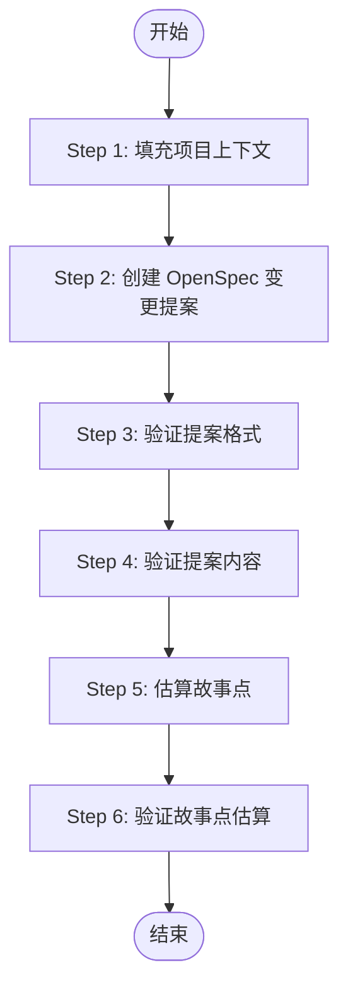

# 项目管理完整流程

基于 PRD 和 Design 文档，自动执行完整的项目管理工作流程，包括：项目上下文填充、OpenSpec 变更提案创建、格式验证、内容审查、故事点估算和验证。

## 工作流程概览

本技能按顺序执行 6 个步骤：



## 前置条件

执行前请确认：

- [ ] `docs/prd/PRD.md` 已存在且完整
- [ ] `docs/design/DESIGN.md` 已存在且完整
- [ ] `AGENTS.md` 项目开发指南已存在
- [ ] 工作目录为项目 workspace 根目录

## 执行步骤

### Step 1: 填充项目上下文

**目标**：补充完善 `openspec/project.md` 文件，填充项目基本信息。

**执行流程**：

1. 读取 `openspec/project.md` 文件（如不存在则跳过此步骤）
2. 参考以下文档提取项目信息：
   - `docs/design/DESIGN.md` - 技术架构、技术栈、系统设计
   - `docs/prd/PRD.md` - 产品需求、业务场景、功能描述
   - `AGENTS.md` - 开发规范、团队协作指南
3. 补充完善以下内容（用中文）：
   - 项目名称和描述
   - 技术栈信息
   - 开发规范说明
   - 项目架构概览
   - 开发环境配置

**验收标准**：

- `openspec/project.md` 包含完整的项目上下文信息
- 内容与 PRD、Design 文档一致
- 使用中文描述

**执行命令**：无需特殊命令，直接读取、编辑文件

---

### Step 2: 创建 OpenSpec 变更提案

**目标**：基于 PRD 和 Design 文档创建详细的 OpenSpec 变更提案，包含任务清单。

**执行流程**：

1. **读取并分析以下文档**：
   - `docs/prd/PRD.md` - 产品需求文档
   - `docs/design/DESIGN.md` - 系统设计文档
   - `AGENTS.md` - 项目代理和开发指南
   - `docs/dev-spec/` - 开发规范文档（必须参考）

2. **参考模板代码**（了解项目代码结构）：
   - `ainative-app/` - 移动端应用模板代码
   - `ainative-backend/` - 后端服务模板代码
   - `ainative-shadow/` - 前端管理后台模板代码

3. **了解 Docker 沙箱开发环境**：
   - `Makefile` - 沙箱管理命令（使用 `make sandbox` 启动沙箱）
   - `sandbox/` - Docker 配置和启动脚本

4. **在 `openspec/changes/{变更名称}/` 创建变更提案**：
   - 生成 `proposal.md` - 变更说明
   - 生成 `design.md` - 技术设计
   - 生成 `specs/` 目录 - 具体规范
   - 生成 `tasks.md` - 任务清单

**重要要求**：

- 任务清单只包含**开发实现任务**（数据库设计、后端实现、前端实现等）
- ❌ 不要生成"测试与验证"章节
- ❌ 不要生成"文档与部署"章节
- 任务清单应该以开发实现为核心，聚焦于代码开发任务
- 必须参考开发规范文档（`docs/dev-spec/`），确保符合项目技术规范
- 必须参考模板代码，了解项目现有的代码结构和实现模式

**Docker 沙箱环境要求**：

- 数据库表创建、数据库迁移等操作必须在 Docker 沙箱环境中运行
- 使用 `make sandbox` 启动沙箱容器
- 使用 `make sandbox-shell` 进入沙箱执行命令
- 沙箱环境已预装：PostgreSQL、Redis、Go、Node.js、Nginx 等开发工具
- 数据库连接信息（参考 `sandbox/Dockerfile`）：
  - DB_HOST=localhost
  - DB_PORT=5432
  - DB_USER=postgres
  - DB_PASSWORD=123456
- 沙箱首次启动会自动初始化 PostgreSQL 数据库并运行 `init.sql` 脚本
- ⚠️ 所有数据库操作都应在容器内执行，不要在宿主机直接操作数据库

**验收标准**：

- 生成完整的 `openspec/changes/{变更名称}/` 目录结构
- `tasks.md` 包含所有开发实现任务
- 每个任务有清晰的描述和验收标准
- 任务按照依赖关系排序

**输出示例**：

```
openspec/changes/add-user-management/
├── proposal.md          # 变更说明
├── design.md            # 技术设计
├── specs/               # 具体规范
│   ├── user-api/spec.md
│   └── user-db/spec.md
└── tasks.md             # 任务清单
```

---

### Step 3: 验证提案格式和结构

**目标**：检查 OpenSpec 变更提案的格式和结构是否符合 OpenSpec 规范。

**执行流程**：

1. 执行命令：`openspec-validate`
2. 检查变更提案的格式、结构是否符合 OpenSpec 规范

**验收标准**：

- 命令返回 `SUCCESS` - 符合规范，继续下一步
- 命令返回 `FAIL` - 不符合规范，需要修正后重新验证

**注意事项**：

- 此步骤检查的是**格式和结构**，不检查内容正确性
- 如果验证失败，根据错误提示修正后重新执行此步骤
- 只有验证通过才能继续后续步骤

---

### Step 4: 验证提案内容

**目标**：基于 PRD 和 Design 文档审查 OpenSpec 规范内容，检查冲突、缺失和错误。

**执行流程**：

调用技能 `openspec-validator`（使用 Skill tool），执行以下操作：

1. 定位当前工作的 openspec 变更目录
2. 收集 PRD 和 design.md 作为基准文档
3. 遍历审查所有 openspec 规范文件：
   - **冲突检查**：与 PRD/design 不一致的内容
   - **缺失检查**：PRD/design 中有但规范中缺失的内容
   - **错误检查**：规范内部的逻辑错误
4. 自动修正发现的问题
5. 生成详细的审查报告

**调用方式**：

读取并执行技能文件 `../skills/openspec-validator/SKILL.md` 中定义的审查流程。

**验收标准**：

- 生成审查报告
- 所有规范文件与 PRD/Design 一致
- 没有遗漏的需求点
- 没有逻辑冲突

**输出示例**：

```markdown
## OpenSpec 审查完成

### 审查摘要

- 修正冲突：3 处
- 补充缺失：5 处
- 修正错误：2 处
- 待人工确认：0 处

### 详细报告

[审查详情...]
```

---

### Step 5: 估算故事点

**目标**：为任务清单中的每个任务估算故事点（Story Points）。

**执行流程**：

1. **定位任务文件**：
   - 在 `openspec/changes/` 目录下查找最新的 `tasks.md` 文件
   - 按修改时间排序，选择最新的

2. **读取基准文档**：
   - 读取 `../skills/project-management/references/story-points-baseline.md`（评估标准）
   - 理解故事点定义和评估维度

3. **分析任务复杂度**：严格按照基准文档中的「技术模块拆分模型」和「模块复杂度分级」进行分析
   - 识别任务涉及的技术模块（数据模型、业务逻辑、接口、数据访问、UI、状态管理等）
   - 为每个模块确定复杂度等级（L1/L2/L3）
   - 识别是否存在协作加权情况（前后端协作、跨服务调用、涉及权限系统、涉及缓存一致性、涉及异步消息机制）

4. **计算并映射故事点**：按照基准文档中的「故事点计算模型」计算总复杂度值，映射到对应故事点
   - 计算总复杂度值 = Σ（模块复杂度权重） + 协作加权（最多 +3）
   - 严格按照映射表转换为故事点（不允许主观调整）
   - 映射表：1-4→0, 5-8→1, 9-12→2, 13-16→3, 17-20→5, ≥21→8

5. **直接在 tasks.md 中添加故事点标记**：
   - 为每个任务添加故事点评估
   - 故事点值必须符合基准文档中的映射表（斐波那契数列：0、1、2、3、5、8）
   - 格式：`**故事点: X**`
   - 位置：在任务描述后添加
   - **必须添加评估说明**，格式：`*评估说明：[模块列表]，总复杂度值 = X → 故事点 Y*`
   - 评估说明必须展示完整的计算过程

6. **确保完整性**：
   - 所有任务都有故事点评估
   - 不要遗漏任何任务

**注意事项**：

- 严格按照评估基准文档中的标准进行评估
- 如果任务超过 8 个故事点，标注并建议拆分
- 用中文完成所有内容
- 保持任务的原有格式和结构

**严格遵守的原则**：

- **禁止主观调整**：不允许在映射后人为"提升"或"降低"故事点
- **客观评估**：如果认为任务更复杂，应重新评估模块复杂度等级（从 L1 提升到 L2 或 L3），而不是调整映射结果
- **避免重复计算**：模块复杂度权重已包含该模块的所有特性，不要再以相同理由额外加权（例如：业务逻辑模块 L2 已包含分支处理逻辑，不要再以"涉及条件分支"为理由提升故事点）
- **映射表是强制性的**：总复杂度值必须严格按照映射表转换，无例外

**验收标准**：

- `tasks.md` 文件中所有任务都有故事点评估
- 故事点标记格式正确：`**故事点: X**`
- 故事点值符合基准文档中的映射表定义

**输出示例**：

```markdown
## 任务 1: 创建用户表

设计并创建用户表（users），包含基本字段...

**故事点: 0**

_评估说明：数据模型模块（L1）= 1，总复杂度值 = 1 → 故事点 0_

## 任务 2: 实现用户 CRUD API

实现用户的增删改查接口，包含权限验证...

**故事点: 2**

_评估说明：业务逻辑模块（L2）= 2，接口模块（L2）= 2，数据访问模块（L2）= 2，涉及权限系统加权 +1，总复杂度值 = 7 → 故事点 1_

## 任务 3: 修改商品详情页

在商品详情页中根据商品类型动态显示/隐藏组件...

**故事点: 2**

_评估说明：UI模块（L3）= 3，状态管理模块（L2）= 2，前后端协作加权 +1，总复杂度值 = 6 → 故事点 1_
```

---

### Step 6: 验证故事点估算

**目标**：确认所有任务都有故事点评估，没有遗漏。

**执行流程**：

1. **读取任务文件**：
   - 读取 `openspec/changes/{变更名称}/tasks.md`

2. **统计任务信息**：
   - 统计文档中的任务总数
   - 统计包含 `**故事点: X**` 标记的任务数量
   - X 必须是基准文档中定义的合法故事点值（0、1、2、3、5、8）

3. **检查完整性**：
   - 验证是否所有任务都有故事点评估
   - 检查故事点值是否合法

4. **返回结果**（JSON 格式）：

```json
{
  "result": "SUCCESS",
  "totalTasks": 10,
  "estimatedTasks": 10,
  "reason": "所有任务都已完成故事点评估"
}
```

或

```json
{
  "result": "INCOMPLETE",
  "totalTasks": 10,
  "estimatedTasks": 8,
  "reason": "有 2 个任务未评估故事点"
}
```

**验收标准**：

- `result` 为 `SUCCESS`
- `totalTasks` 等于 `estimatedTasks`
- 所有故事点值合法

**注意事项**：

- 只返回 JSON，不要返回其他内容
- 如果验证失败，需要返回 Step 5 补充评估

---

## 完整流程输出

完成所有 6 个步骤后，输出以下总结：

```markdown
## 项目管理流程完成

### 执行摘要

✅ Step 1: 项目上下文已填充
✅ Step 2: OpenSpec 变更提案已创建
✅ Step 3: 提案格式验证通过
✅ Step 4: 提案内容审查完成（修正 X 处问题）
✅ Step 5: 故事点估算完成（共 Y 个任务）
✅ Step 6: 故事点验证通过

### 输出文件

- `openspec/project.md` - 项目上下文
- `openspec/changes/{变更名称}/proposal.md` - 变更提案
- `openspec/changes/{变更名称}/design.md` - 技术设计
- `openspec/changes/{变更名称}/specs/` - 规范文件
- `openspec/changes/{变更名称}/tasks.md` - 任务清单（包含故事点评估）

### 统计信息

- 任务总数：Y 个
- 总故事点：Z 点
- 预估工作量：约 W 人天

### 下一步行动

- [ ] 审查任务清单和故事点评估
- [ ] 根据优先级和依赖关系安排开发顺序
- [ ] 分配任务给开发团队
- [ ] 开始执行开发任务
```

## 错误处理

### 缺少前置文档

**错误**：找不到 PRD 或 Design 文档

**处理**：

1. 检查 `docs/prd/PRD.md` 是否存在
2. 检查 `docs/design/DESIGN.md` 是否存在
3. 如果缺失，中止流程并提示用户先完成 PRD/Design

### 格式验证失败

**错误**：Step 3 返回 FAIL

**处理**：

1. 查看 `openspec-validate` 的错误提示
2. 根据提示修正格式问题
3. 重新执行 Step 3
4. 不要跳过此步骤

### 故事点验证失败

**错误**：Step 6 返回 INCOMPLETE

**处理**：

1. 查看哪些任务缺少故事点
2. 返回 Step 5 补充评估
3. 重新执行 Step 6 验证

## 注意事项

1. **严格按顺序执行**：每个步骤都有依赖关系，不能跳过或调换顺序
2. **验证通过才继续**：Step 3 和 Step 6 的验证必须通过才能继续
3. **保持文件一致性**：修改文件时注意与其他文档的一致性
4. **使用中文输出**：所有输出文件和描述都使用中文
5. **引用其他技能**：Step 4 需要调用 `openspec-validator` 技能
6. **Docker 环境**：数据库相关操作必须在沙箱环境中执行

## 相关技能

- `openspec-validator` - OpenSpec 内容验证（Step 4 使用）
- `backend-dev` - 后端开发流程（任务执行阶段使用）
- `prd` - PRD 生成（前置步骤）
- `design` - Design 生成（前置步骤）

## 使用场景

触发此技能的场景：

1. PRD 和 Design 文档都已完成，需要进行任务拆解
2. 需要生成 OpenSpec 变更提案和任务清单
3. 需要为任务估算故事点，规划开发工作量
4. 项目启动阶段，需要完整的项目管理流程
5. 用户明确提到"项目管理"、"任务拆解"、"故事点估算"等关键词
