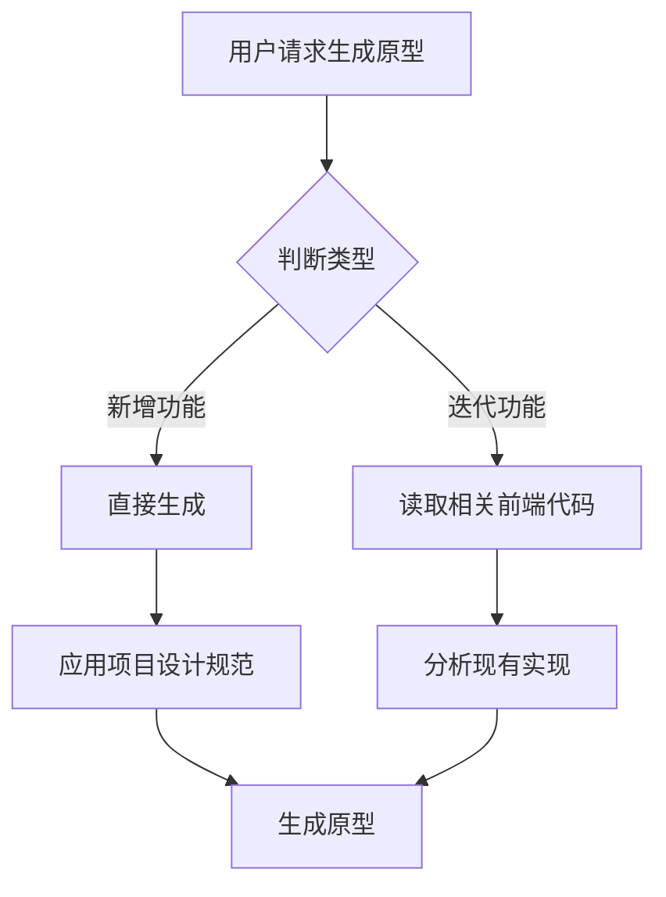

# 单文件原型生成器

生成独立的 HTML 原型文件，双击即可演示，样式参考项目设计系统。

## 核心特性

- **单文件输出**: `docs/prototype/{feature}/index.html`
- **零依赖**: CDN 引入 Vue3/Element Plus，无需 npm install
- **样式一致**: 自动应用项目设计标准（颜色/字体/间距）
- **立即可用**: 双击打开或本地服务器预览

---

## 项目结构说明（workspace 根目录下）

项目实际代码位于 **workspace 根目录** 下，常见结构：

| 目录               | 用途                        | 原型类型          |
| ------------------ | --------------------------- | ----------------- |
| `ainative-shadow/` | 后台管理系统（PC 端）       | 管理后台原型      |
| `ainative-app/`    | 小程序（移动端）            | 移动端/小程序原型 |
| `frontend/`        | 单前端项目（如 Mind2Build） | 按实际用途判断    |

**路径解析规则**：生成原型前，先检查 workspace 下存在 `ainative-shadow`、`ainative-app`、`frontend` 中的哪些目录，再确定参考代码的根路径 `{root}`。

---

## 快速生成流程

### Step 0: 判断原型类型（新增 vs 迭代）

**新增**：用户描述的是全新页面/功能，项目中无对应 views 或 components → 直接生成，应用项目设计规范。

**迭代**：用户描述的是对已有页面/功能的改进（如「优化 Dashboard 统计卡片」「改进 PlatformList 的筛选」）→ 先读取相关前端代码，再基于现有实现生成一致的原型。



### Step 1: 确定原型类型

**管理后台** (ainative-shadow 风格):

- 数据列表、表单、仪表盘、统计卡片
- 使用 Element Plus 组件
- PC 端布局（最大宽度 1200px）

**移动端** (ainative-app 风格):

- 商品列表、表单、详情页、搜索
- 原生 HTML + Vue3
- 移动端优化（最大宽度 750px）

### Step 2: 应用设计标准（参考项目实际）

从 workspace 根目录下项目提取设计 token。**来源文件**（路径相对于 workspace 根目录，`{root}` 按项目实际为 `ainative-shadow`、`ainative-app` 或 `frontend`）：

- **管理后台**：`ainative-shadow/src/style.css`、`ainative-shadow/src/App.vue`（若存在）；否则 `frontend/src/`
- **小程序**：`ainative-app/src/` 下对应样式与入口文件

若无法读取项目文件，使用以下默认 Design Tokens（Element Plus 风格）：

```css
:root {
  --primary-color: #409eff;
  --success-color: #67c23a;
  --warning-color: #e6a23c;
  --error-color: #f56c6c;
  --text-color: #303133;
  --text-secondary: #909399;
  --bg-color: #f5f7fa;
  --spacing-md: 16px;
  --spacing-lg: 24px;
  --border-radius: 4px;
  --box-shadow: 0 2px 4px rgba(0, 0, 0, 0.08);
}
```

### Step 3: 生成原型文件

**输出位置**: `docs/prototype/{feature-name}/index.html`

**文件结构**:

```html
<!DOCTYPE html>
<html lang="zh-CN">
  <head>
    <!-- CDN 依赖 -->
    <!-- 设计标准 CSS -->
  </head>
  <body>
    <!--
    原型说明注释：
    - 功能描述
    - 使用方法
    - 原型限制
    - 下一步计划
  -->

    <div id="app">
      <!-- 原型标记 -->
      <div class="prototype-badge">🚧 原型</div>

      <!-- 页面内容 -->
    </div>

    <!-- Vue3 + 业务逻辑 -->
  </body>
</html>
```

---

## 迭代场景：前端代码参考

当原型类型为**迭代**时，必须先读取 workspace 下相关前端代码，再生成与现有实现风格一致的原型。

**必读路径**（按功能域选择）：

- 页面级：`{root}/src/views/{domain}/{*.vue}` 或 `{root}/src/pages/{domain}/{*.vue}`
- 通用组件：`{root}/src/components/common/*.vue`
- 领域组件：`{root}/src/views/{domain}/components/*.vue` 或 `{root}/src/pages/{domain}/components/*.vue`
- 样式：`{root}/src/style.css`、`{root}/src/App.vue` 的 style 块

**参考要点**：布局结构、组件组合、颜色/间距/圆角/阴影、数据流、图标使用。

详细说明见 [iteration-guide.md](references/iteration-guide.md)。

---

## 原型标记规范

### 顶部注释

```html
<!--
  原型名称: 用户列表
  创建时间: 2026-02-03
  
  功能说明:
  - 用户列表展示
  - 搜索筛选
  - CRUD 操作
  
  如何使用:
  1. 双击打开或使用本地服务器
  2. 测试核心功能
  
  原型限制:
  - 使用模拟数据
  - 未实现真实 API
  
  下一步:
  1. 在项目中创建正式组件
  2. 对接后端 API
-->
```

### 视觉徽章

```html
<div class="prototype-badge">🚧 原型</div>
```

---

## 开发检查清单

生成原型前确认：

- [ ] 已判断类型（新增 / 迭代）
- [ ] 确定类型（管理后台/移动端）
- [ ] 选择合适的基础模板
- [ ] 应用项目设计标准
- [ ] **若为迭代**：已读取相关 `{root}/src/views/` 或 `{root}/src/pages/` 与 `{root}/src/components/` 代码
- [ ] 设计 token 已与项目实际样式文件对齐

生成原型后确认：

- [ ] 单个 HTML 文件
- [ ] 包含顶部功能说明注释
- [ ] 包含原型标记徽章
- [ ] 核心功能可演示
- [ ] 保存到 `docs/prototype/{feature}/index.html`
- [ ] **若为迭代**：布局与组件风格与现有页面一致

---

## 附加资源

| 资源                                                    | 说明                                       |
| ------------------------------------------------------- | ------------------------------------------ |
| [templates.md](references/templates.md)                 | 管理后台/移动端完整模板、CDN 资源          |
| [common-prototypes.md](references/common-prototypes.md) | 常用功能片段、常见组件、快速参考、打开方式 |
| [iteration-guide.md](references/iteration-guide.md)     | 迭代场景详细指南、功能域推断               |
| [shadow-examples.md](references/shadow-examples.md)     | 管理后台完整示例（用户列表、数据仪表盘）   |
| [app-examples.md](references/app-examples.md)           | 移动端完整示例（商品列表、表单提交）       |
